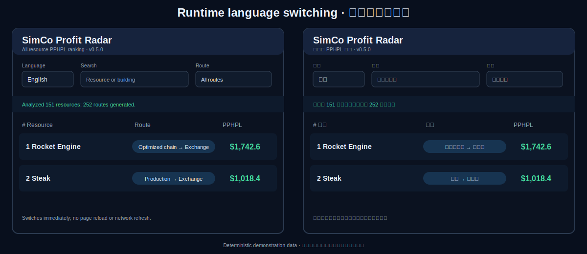
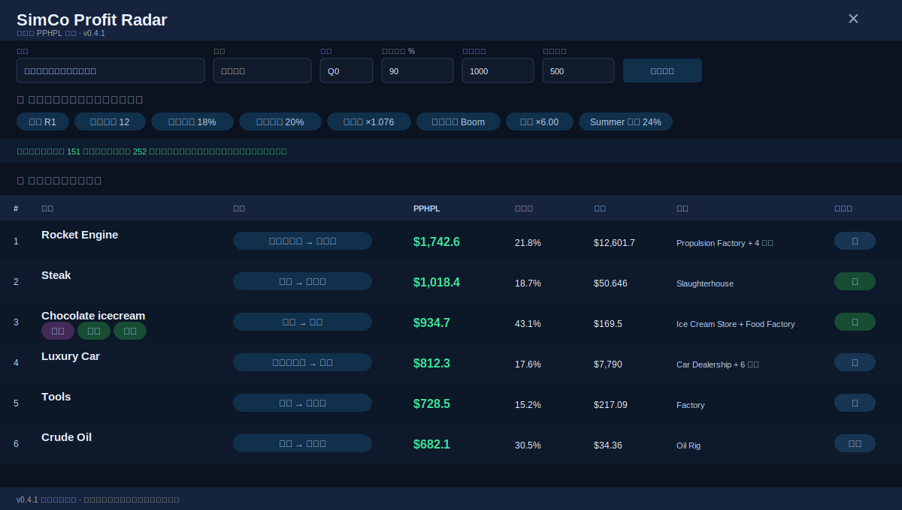
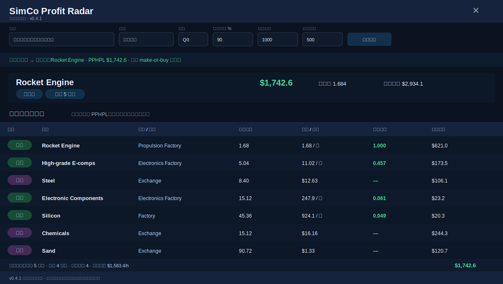
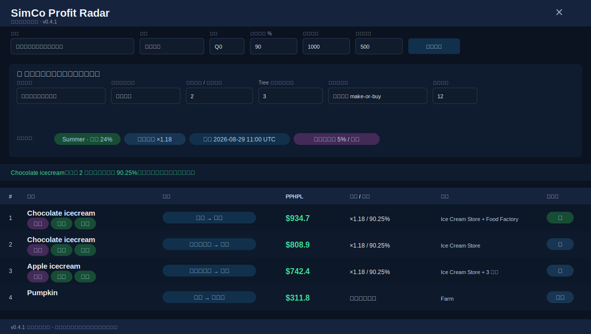

# SimCo Profit Radar v0.5.0

[](LICENSE)
[](manifest.json)
[](src/i18n.js)

A read-only Chrome / Edge Manifest V3 extension for SimCompanies. It ranks production, retail, and multi-stage make-or-buy industry chains by **PPHPL** (net profit per real hour per building level).

一个只读的 SimCompanies Chrome / Edge 扩展，用于按 **PPHPL（每现实小时、每建筑等级净利润）** 比较生产、零售和多级产业链。

> Unofficial community tool. Read-only analysis only: no telemetry, automated trading, production, contracts, or other game actions.
>
> 非官方社区工具，仅执行只读分析；无遥测，不执行自动交易、生产、合同或其他游戏操作。

## v0.5.0 — English / 中文

- **English is the default language.**
- Use the first toolbar selector, **Language**, to switch between `English` and `中文`.
- The panel changes immediately without reloading SimCompanies or refetching data.
- The selected language is saved and restored automatically.
- Controls, routes, diagnostics, profile fields, status messages, HTTP 429 recovery, result tags, detail panels, seasonal fields, and industry-chain tables are localized.
- Numbers and dates use `en-US` or `zh-CN` formatting according to the active language.

默认语言为**英文**。在面板顶部第一个 `Language` 下拉框中选择 `中文` 即可立即切换；无需刷新游戏页面，选择会自动保存。

## UI preview

The screenshots use deterministic demonstration data and do **not** represent live market prices or rankings.

### Runtime language switching



### Full-category PPHPL ranking



### Multi-stage make-or-buy chain details



### Seasonal settings, weather, and decay



## Download and install

The verified v0.5.0 archive is generated from the staged release patch by the repository workflow **Reconstruct v0.5.0 release**. After that workflow completes, download:

- `dist/simco-profit-radar-v0.5.0.zip`
- `dist/simco-profit-radar-v0.5.0.sha256`

If those two files are not visible yet, open the repository **Actions** tab, select **Reconstruct v0.5.0 release**, choose **Run workflow** on `main`, and wait for the bot commit named `release: publish SimCo Profit Radar v0.5.0`.

Installation:

1. Download and unzip `dist/simco-profit-radar-v0.5.0.zip`.
2. Open `chrome://extensions` or `edge://extensions`.
3. Enable **Developer mode**.
4. Choose **Load unpacked**.
5. Select the extracted `simco-profit-radar` folder.
6. Refresh SimCompanies and open **Profit Radar / 利润雷达**.

## Features

- Production → Exchange
- Exchange purchase → Retail
- Production → Retail
- Optimized multi-stage chain → Exchange
- Optimized multi-stage chain → Retail
- Recursive make-or-buy optimization across upstream inputs
- Seasonal production and retail handling
- Summer weather, Pumpkin seasonality, Tree quality mechanics, and ice-cream decay
- Current account production/sales modifiers and acceleration
- Rate-limit-safe loading with HTTP 429 cooldown and stale-cache fallback
- Runtime English/Chinese switching with persistent settings

## Development

```bash
npm ci
npm test
npm run check
```

v0.5.0 passed **64/64 automated tests** plus JavaScript syntax checks. See [SELF_CHECK.md](SELF_CHECK.md).

## Limitations

The optimizer is a steady-state operating model. It does not fully model integer building layouts, construction capital, order-book depth, inventory timing, or company-wide multi-product portfolio optimization. Product names supplied by SimCompanies or SimcoTools are displayed as provided; arbitrary product names are not machine-translated.

## License

MIT. See [LICENSE](LICENSE).
